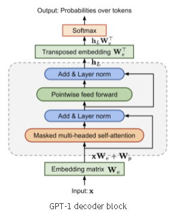

# baseline

- model: Transformer Decoder
    - Vocabulary Size: 32,000 (SentencePiece or BPE)
    - Hidden Size: 512
    - Number of Layers: 12
    - Number of Attention Heads: 8
    - Feedforward Dimension: 2048
    - Dropout Rate: 0.1
